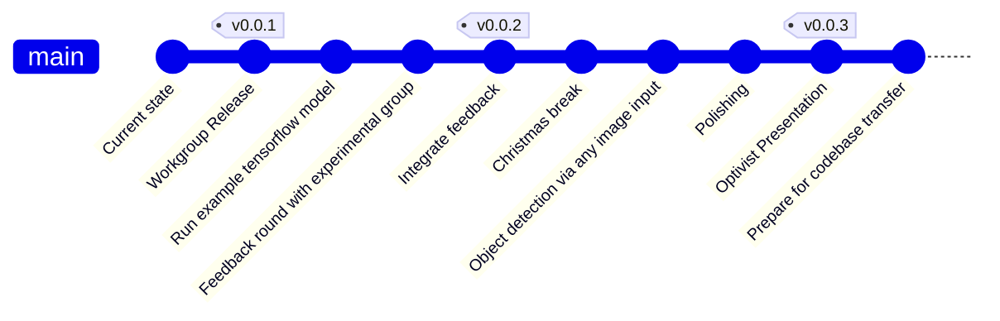

# Natural Language Interface

This is the code repository for the Android app developed in the studyproject Sensory augmentation and grasping movements.

[](https://github.com/StudyProject-NLI/NLInterface/actions/workflows/debug_build.yml)

# Roadmap



# Documentation

## Running locally
- Install Python
- `pip install -r docs/requirements.txt`

Run the documentation server via 
```bash
$ mkdocs serve
```


# Building the app locally
Requirements:
- At least Java 8 JDK installed
- Create a `local.properties` file at the root of this repository with the following content

```bash
MAPS_API_KEY=your_google_maps_api_key
```

You can request your keys via the [Google Maps Platform](https://developers.google.com/maps/documentation/embed/get-api-key).

Then build the application with 

```
./gradlew build -x lint -x lintVitalRelease
```

on MacOS or Linux based operating systems.

The resulting installable application can be found under 

`app/build/outputs/apk/debug/app-debug.apk`

which you can copy and install on your device.
