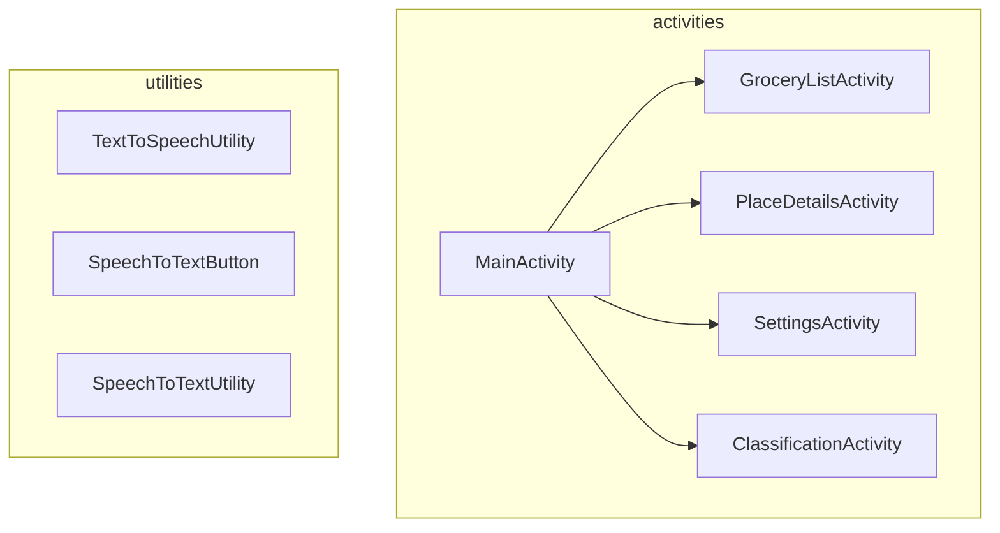

# How is our app structured?

```mermaid
flowchart
	subgraph activities
	m[MainActivity]
	m --> GroceryListActivity
	m --> PlaceDetailsActivity
	m --> SettingsActivity
	m --> ClassificationActivity
	
	click m "activities/MainActivity.html"
	click GroceryListActivity "activities/GroceryListActivity.html"
	click PlaceDetailsActivity "activities/PlaceDetailsActivity.html"
	click SettingsActivity "activities/SettingsActivity.html"
	click ClassificationActivity "activities/ClassificationActivity.html"


	end
	subgraph utilities
	TextToSpeechUtility
	SpeechToTextButton
	SpeechToTextUtility
	
	end
```