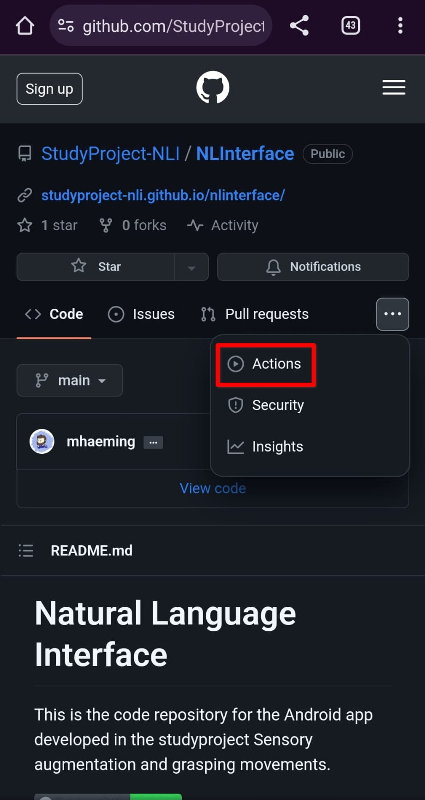
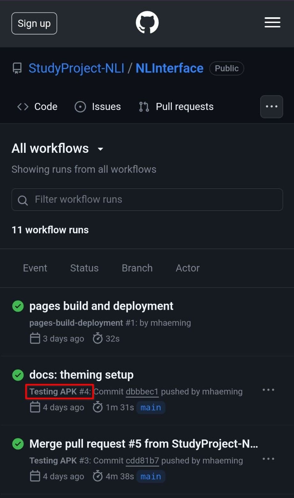
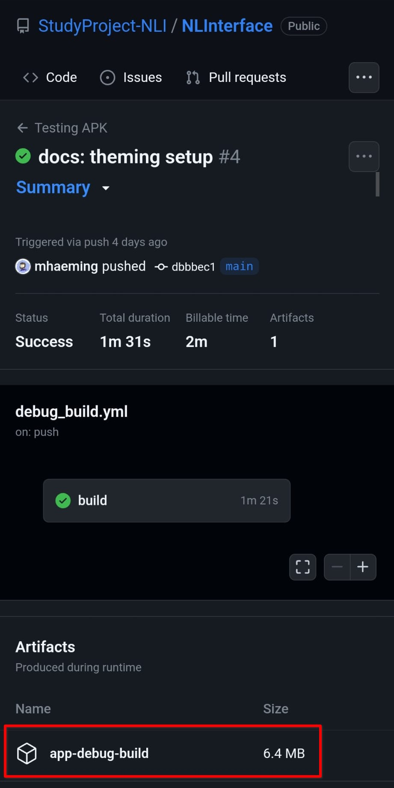

# Install Debug Build from GitHub Actions

You can always install latest version of the main branch directly from GitHub Actions.

!!! warning
    The latest build on the main branch is considered bleeding edge and will most **certainly contain bugs**!
    Only use it when you are testing and are fine with the app breaking.
    
    For more stabilized versions, use the one of the [official releases](install_from_release.md).

## Prerequisites

- An Android device in [developer mode](https://developer.android.com/studio/debug/dev-options)
- You are logged into your GitHub account on your device

Open up the repo on your device by following the link 

[https://github.com/StudyProject-NLI/NLInterface](https://github.com/StudyProject-NLI/NLInterface)

and navigate to the **Actions** tab by pressing the three dots button on the right.

Select a successfull workflow run of **Testing APK**

Download the app-debug-build artifact.

